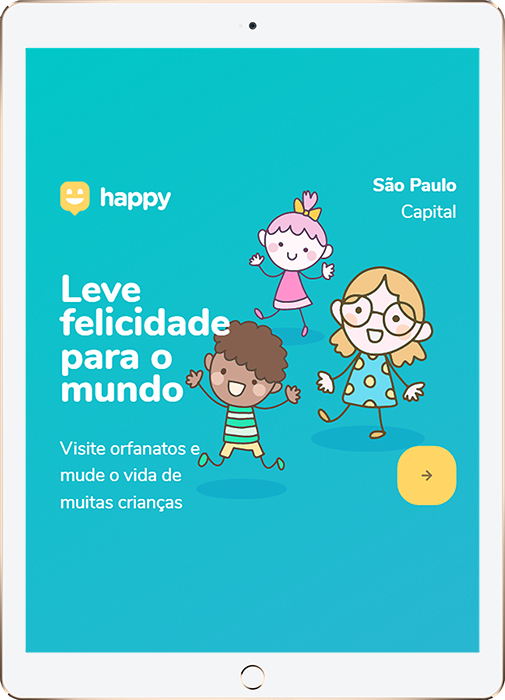

<h1 align="center">
    
</h1>

  <a href="#rocket-tecnologias">Tecnologias</a>&nbsp;&nbsp;&nbsp;|&nbsp;&nbsp;&nbsp;
  <a href="#-projeto">Projeto</a>&nbsp;&nbsp;&nbsp;|&nbsp;&nbsp;&nbsp;
  <a href="#-layout">Layout</a>&nbsp;&nbsp;&nbsp;|&nbsp;&nbsp;&nbsp;
  <a href="#memo-licença">Licença</a>

  
 

 

  
    

## 🚀 Tecnologias

Esse projeto foi desenvolvido utilizando as seguintes tecnologias:

- [Node.js](https://nodejs.org/en/)
- [Express](https://expressjs.com/pt-br/)
- [SQLite](https://www.sqlite.org/index.html)
- [handlebars](https://handlebarsjs.com/)

## 💻 Projeto

O Happy é um projeto que visa facilitar visitas à casas de acolhimento institucionais próximos a você.

Este projeto é de responsabilidade da Rocketseat e foi desenvolvido durante a 3a edição da **[Next Level Week](https://nextlevelweek.com/)** - Trilha Discovery, realizada pela **[@Rocketseat](https://github.com/Rocketseat)** entre os dias 12 a 18 de Outubro de 2020.
 
## 🔖 Layout

Você pode visualizar o layout do projeto através dos links abaixo:

- [Layout Web](https://www.figma.com/file/mDEbnoojksG4w8sOxmudh3/Happy-Web?node-id=0%3A1) 
- [Layout Mobile](https://www.figma.com/file/X27FfVxAgy9f5IFa7ONlph/Happy-Mobile?node-id=0%3A1) 

Lembrando que você precisa ter uma conta no [Figma](http://figma.com/) para acessá-lo.

## 📝 Licença

Esse projeto está sob a licença MIT. Veja o arquivo [LICENSE](LICENSE.md) para mais detalhes.

---

Desenvolvido por Erik Ieto

